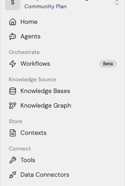
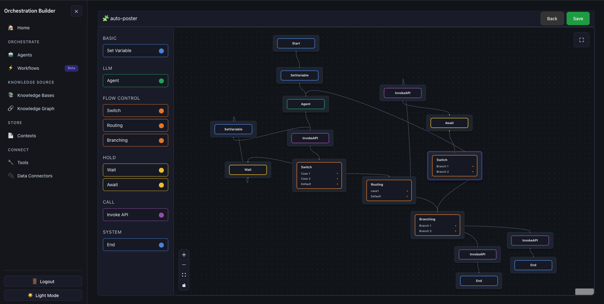

  <strong>Self Experience Speaks a Lot More Than Words.</strong>

  👉 
  <a href="https://aob-client-website.pages.dev/" target="_blank"><b>Live Demo</b></a>
  👈
   
  <a href="https://aob-client-website.pages.dev/" target="_blank"><i>https://aob-client-website.pages.dev</i></a>

  
   
  

  <strong>And a Walkthrough by the Creator makes us to Understand a Lot about <i>Behind & Beyond</i></strong>
   
  🎥 <a href="https://www.youtube.com/watch?v=YOUR_VIDEO_ID" target="_blank"><b>Watch Video Demo</b></a>
   
  <a href="https://youtube.com/" target="_blank"><i>https://youtube.com/</i></a>

## Implementation

The whole Project or Challenge needs the below three Github Repos

| Project Name | Github Link                                                                                   |
| :----------- | :-------------------------------------------------------------------------------------------- |
| Frontend     | <a href="https://github.com/Sathyamshubhava/aob-client-website"> Cloudflare Pages             |
| Database     | <a href="https://github.com/Sathyamshubhava/aob-d1-db"> D1 Cloudflare (Sqlite)                |
| Backend      | <a href="https://github.com/Sathyamshubhava/aob-workers"> Cloudflare Workers & Qstash Upstash |

### ☁️ Backend & Cloud Infrastrucsture

| Requirement     | Component - Cloud Provider |
| :-------------- | :------------------------- |
| Authentication  | Authentication - Firebase  |
| Database        | D1 - Cloudflare            |
| Queue Stack     | Qstash - Upstash           |
| Functions       | Workers - Cloudflare       |
| Website Hosting | Pages - Cloudflare         |

### 🎨 Frontend Stack

| Category         | Tool / Library |
| :--------------- | :------------- |
| JS Library       | React          |
| Language         | Typescript     |
| Build Tool       | Vite           |
| CSS              | Bulma          |
| Visual Editor    | React Flow     |
| Routing          | React Router   |
| State Management | Zustand        |
| Linting          | ESLint         |
| Code Formatter   | Prettier       |

#### Components in this Orchestration Builder App

<table>
<tr>
<td>

</td>
<td>

| New Implementation |
| ------------------ |
| Workflows          |
| Contexts           |

 

| Same As Lyzr Agent Studio |
| ------------------------- |
| Home                      |
| Agents                    |
| Knowledge Bases           |
| Knowledge Graph           |
| Tools                     |
| Data Connectors           |

</td>
</tr>

</table>

#### Just A Preview

